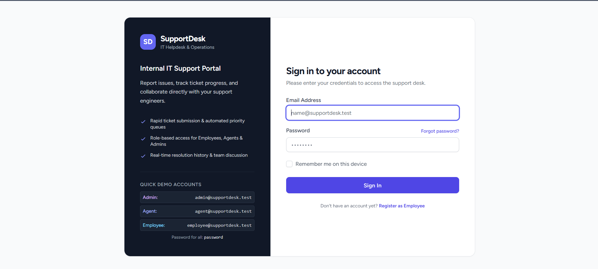
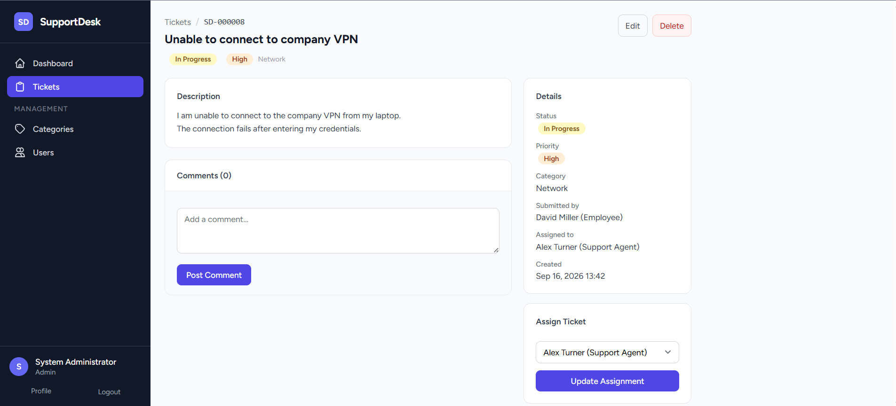
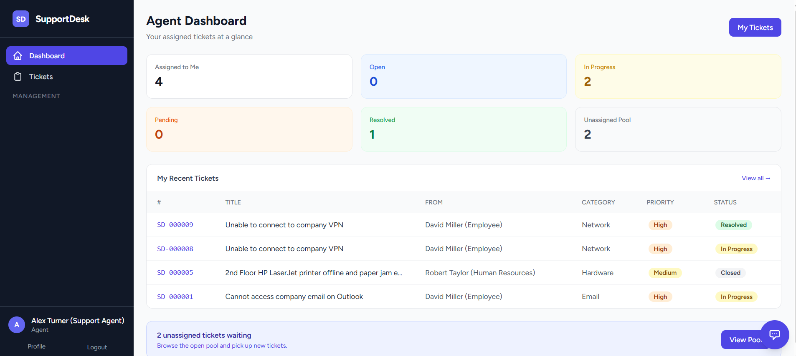
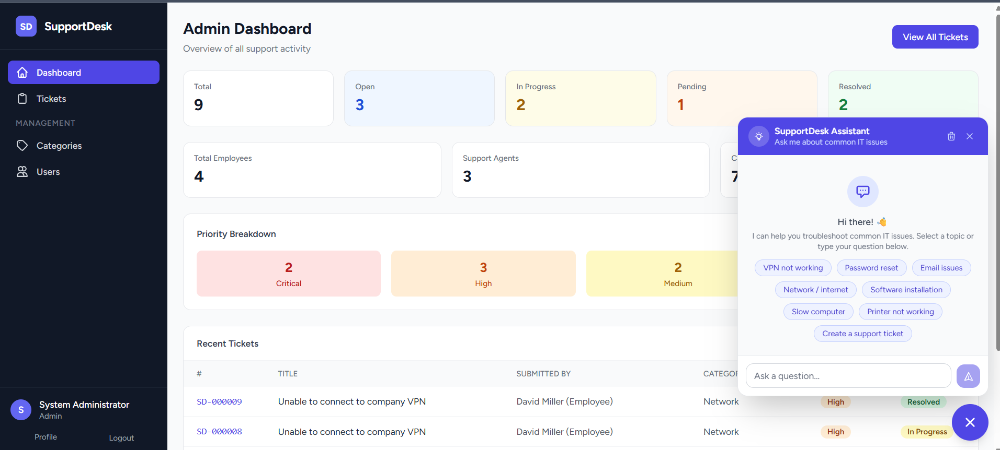
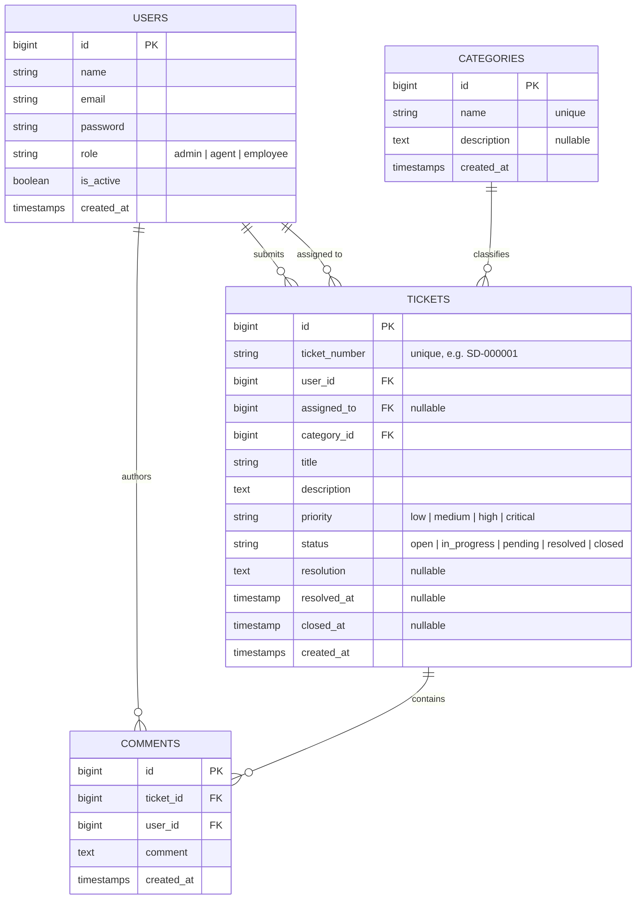

# SupportDesk — IT Helpdesk & Support Ticket Management System

SupportDesk is a realistic, portfolio-ready IT Helpdesk and Ticket Management web application built with **Laravel 13**, **PHP 8.4**, **Blade Templates**, **Tailwind CSS**, and **MySQL**.

The application follows standard Laravel MVC architecture, utilizing Eloquent ORM relationships, Form Requests for strict validation, dedicated Laravel Policies and Middleware for role-based access control (RBAC), and automated feature testing via PHPUnit.

---

## Key Features

- **Role-Based Access Control (RBAC)**: Distinct permissions for **Admin**, **Agent**, and **Employee** roles.
- **Role-Tailored Dashboards**:
  - **Admin**: System-wide ticket analytics, employee/agent counts, category counts, priority distribution, and recent ticket activity.
  - **Agent**: Quick stats for assigned tickets, status breakdown, recent assignments, and direct access to the unassigned ticket pool.
  - **Employee**: Overview of submitted requests, status tracking, and quick link to submit new issues.
- **Full Ticket Lifecycle Management**:
  - Auto-generated human-readable ticket numbers (e.g. `SD-000001`).
  - Search tickets by ticket number or title with debounce.
  - Multi-criteria filtering by Status, Priority, and Category with preserved pagination (`withQueryString()`).
  - Priority levels (`Low`, `Medium`, `High`, `Critical`) and Statuses (`Open`, `In Progress`, `Pending`, `Resolved`, `Closed`).
  - Resolution logs with automated resolution timestamps (`resolved_at`, `closed_at`).
- **Assignment System**: Administrators can assign and reassign tickets to active support agents, automatically advancing status to `In Progress`.
- **Chronological Discussion / Comments**: Ticket owners, assigned agents, and admins can converse with real-time timestamps and role indicators.
- **Category Management**: Admin CRUD for organizing support topics with relational deletion guards (cannot delete categories with active tickets).
- **User Management**: Admin listing, real-time search, role filtering, role adjustments, and account activation/deactivation guards (preventing self-lockout or self-demotion).
- **Clean Responsive UI**: Modern sidebar navigation, clean data tables, responsive action modals, status/priority badges, and flash alert notifications.

---

## Screenshots

### 🔐 Authentication

The application provides a responsive authentication interface for SupportDesk users.



### 📊 Role-Based Dashboards

Dashboards are tailored to each role, providing relevant statistics and actions.



### 🎫 Ticket Management

Employees can submit support requests while agents and administrators manage the ticket lifecycle..



### 🤖 SupportDesk Assistant

A knowledge-based assistant provides troubleshooting guidance for common IT issues and allows users to escalate unresolved problems into support tickets.



---

## Role & Permission Matrix

| Feature / Action | Employee | Support Agent | Administrator |
|:---|:---:|:---:|:---:|
| View Role-Specific Dashboard | Yes (Personal) | Yes (Assigned) | Yes (Global) |
| Create New Ticket | Yes | Yes | Yes |
| View Tickets | Own Tickets Only | Assigned & Ticket Pool | All Tickets |
| Update Status | Close / Reopen Own | Full Status & Resolution | Full Status & Resolution |
| Assign / Reassign Agent | No | No | Yes |
| Add Comments | Own Tickets | Assigned Tickets | All Tickets |
| Delete Ticket | No | No | Yes |
| Category Management (CRUD) | No | No | Yes |
| User Management & Role Assignment | No | No | Yes |

---

## Technology Stack

- **Backend**: PHP 8.4, Laravel 13.x
- **Database**: MySQL (Development), SQLite `:memory:` (Automated Testing)
- **Frontend**: Blade Templates, Tailwind CSS, Alpine.js
- **Asset Bundler**: Vite 8
- **ORM**: Eloquent ORM
- **Authentication**: Laravel Breeze (Blade stack)
- **Authorization**: Role-Based Access Control (RBAC), Middleware & Policies
- **Testing**: PHPUnit 12.x (73 automated feature and unit tests)
- **Code Quality**: Laravel Pint
- **Version Control**: Git & GitHub

---

## Database Architecture



---

## Installation & Setup

### 1. Prerequisites
- PHP 8.4+
- Composer 2.x
- Node.js 22.x & npm
- MySQL Server

### 2. Clone and Setup Environment
```bash
git clone <repository-url> supportdesk
cd supportdesk

# Install dependencies
composer install
npm install

# Setup environment
copy .env.example .env
php artisan key:generate
```

### 3. Database Configuration
Update `.env` with your database credentials:
```env
DB_CONNECTION=mysql
DB_HOST=127.0.0.1
DB_PORT=3306
DB_DATABASE=supportdesk
DB_USERNAME=root
DB_PASSWORD=your_password
```

### 4. Run Migrations & Seed Demo Data
```bash
php artisan migrate --seed
```

### 5. Build Assets & Start Server
```bash
# Build frontend assets
npm run build

# Start local server
php artisan serve
```

Access the application in your browser at: `http://127.0.0.1:8000`

---

## Demo Credentials

All seeded accounts share the password: `password`

| Role | Email | Access Scope |
|:---|:---|:---|
| **Administrator** | `admin@supportdesk.test` | System stats, all tickets, category CRUD, user management |
| **Support Agent** | `agent@supportdesk.test` | Assigned tickets, ticket pool, status/resolution updates |
| **Support Agent** | `sarah.agent@supportdesk.test` | Support agent workflows |
| **Support Agent** | `mike.agent@supportdesk.test` | Support agent workflows |
| **Employee** | `employee@supportdesk.test` | Personal dashboard, submit requests, view/close own tickets |
| **Employee** | `jane.smith@supportdesk.test` | Standard employee workflows |
| **Employee** | `robert.taylor@supportdesk.test` | Standard employee workflows |

---

## Automated Testing

The application includes an extensive automated test suite covering authentication, role policies, ticket lifecycle, category management, and user administration.

Run the test suite:
```bash
php artisan test
```

### Code Style Formatting
```bash
vendor/bin/pint --dirty --format agent
```

